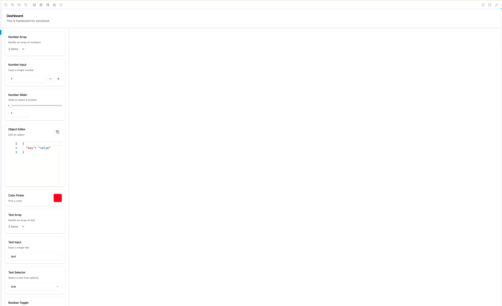
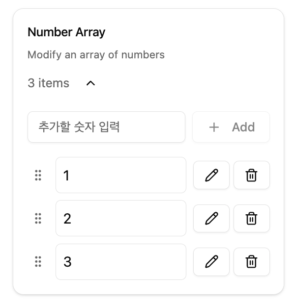
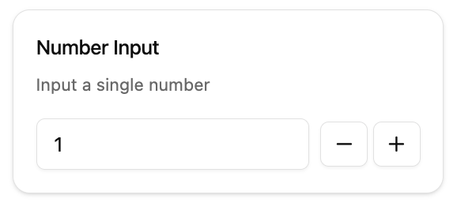
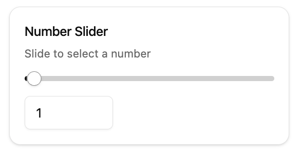
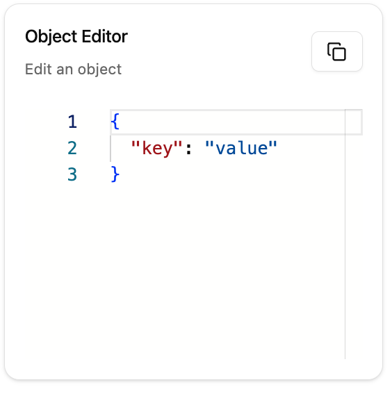
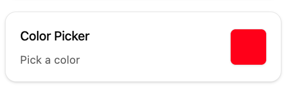
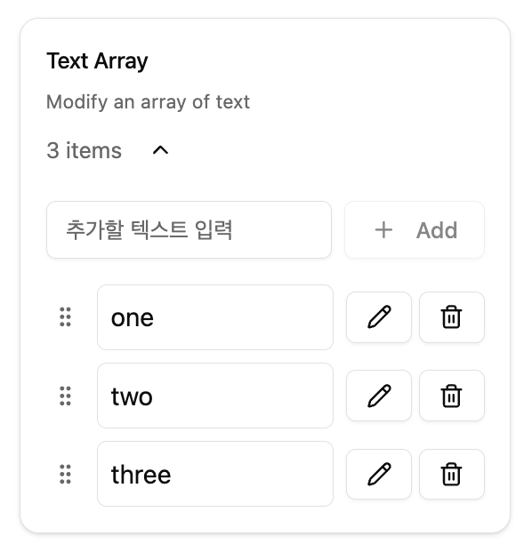
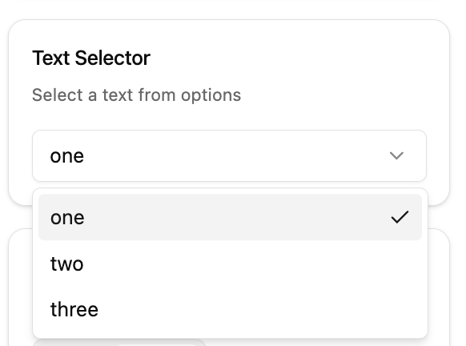
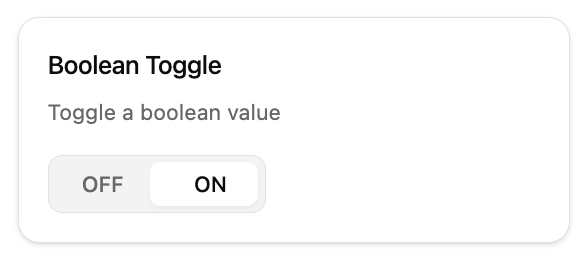

## Storybook Configurator

#### Setup your story INTERACTIVE and EASY

---

### Docs

-   EVERY components has same common props
    -   title ( string )
        -   title of this component
    -   description ( string )
        -   description of this component

#### Dashboard



##### props

-   **controls**

    -   array of control components, will be place on left

-   options

```
{
    minWidth: number
}
```

-   minimum width of control portion

-   children
    -   component to show

<details>
<summary>코드 보기</summary>
<pre><code>
() => {
        const [state, setState] = useControlState({
            numberarray: [1, 2, 3],
            numberinput: 1,
            numberslider: 1,
            objecteditor: { key: 'value' },
            colorpicker: '#ff0000',
            textarray: ['one', 'two', 'three'],
            textinput: 'text',
            textselect: 'one',
            booltoggle: true,
        });

        const textselectOptions = ['one', 'two', 'three'];

        const controls = [
            <NumberArray
                title="Number Array"
                description="Modify an array of numbers"
                key="numberarray"
                value={state.numberarray}
                setValue={(value: number[]) => setState('numberarray', value)}
            />,
            <NumberInput
                title="Number Input"
                description="Input a single number"
                key="numberinput"
                value={state.numberinput}
                setValue={(value: number) => setState('numberinput', value)}
            />,
            <NumberSlider
                title="Number Slider"
                description="Slide to select a number"
                key="numberslider"
                value={state.numberslider}
                setValue={(value: number) => setState('numberslider', value)}
            />,
            <ObjectEditor
                title="Object Editor"
                description="Edit an object"
                key="objecteditor"
                value={state.objecteditor}
                setValue={(value: unknown) => setState('objecteditor', value)}
            />,
            <ColorPicker
                title="Color Picker"
                description="Pick a color"
                key="colorpicker"
                value={state.colorpicker}
                setValue={(value: string) => setState('colorpicker', value)}
            />,
            <TextArray
                title="Text Array"
                description="Modify an array of text"
                key="textarray"
                value={state.textarray}
                setValue={(value: string[]) => setState('textarray', value)}
            />,
            <TextInput
                title="Text Input"
                description="Input a single text"
                key="textinput"
                value={state.textinput}
                setValue={(value: string) => setState('textinput', value)}
            />,
            <TextSelector
                title="Text Selector"
                description="Select a text from options"
                key="textselect"
                value={state.textselect}
                selected={state.textselect}
                setSelected={(value: string) => setState('textselect', value)}
                select={textselectOptions}
            />,
            <BoolToggle
                title="Boolean Toggle"
                description="Toggle a boolean value"
                key="booltoggle"
                value={state.booltoggle}
                setValue={(value: boolean) => setState('booltoggle', value)}
            />,
        ];

        return (
            <Dashboard
                controls={controls}
                title="Dashboard"
                description="This is Dashboard for storybook"
            >
                <input type="text" />
            </Dashboard>
        );
    }

</code></pre>

</details>

---

### Controls and Hooks

#### useControlState

-   Can manage multiple states easily

```
const [state, setState] = useControlState({
            numberarray: [1, 2, 3],
            numberinput: 1,
            numberslider: 1,
            objecteditor: { key: 'value' },
            colorpicker: '#ff0000',
            textarray: ['one', 'two', 'three'],
            textinput: 'text',
            textselect: 'one',
            booltoggle: true,
        });
```

-   Each key is states and value is default value
-   Automatically create a state

```
state.numberarray
// Value of state

setState('numberarray', value)
// set Value on state
```

### Controls

-   Every control component has Common props
    -   value ( state.{key} from useControlStates)
    -   setValue ( follow example of each control )
    -   key ( unique value for each controls )

#### NumberArray

-   Modify number array for component



```
<NumberArray
    title="Number Array"
    description="Modify an array of numbers"
    key="numberarray"
    value={state.numberarray}
    setValue={(value: number[]) => setState('numberarray', value)}
/>,
```

#### NumberInput

-   Modify number for component



##### option props

```
option?: {
    min?: number;
    // minimum possible value
    max?: number;
    // maximum possible value
    step?: number;
    // step for click event
};
```

```
<NumberInput
    title="Number Input"
    description="Input a single number"
    key="numberinput"
    value={state.numberinput}
    setValue={(value: number) => setState('numberinput', value)}
/>
```

#### Number Slider

-   Slider for number state



##### option props

```
option?: {
    min?: number;
    // minimum possible value
    max?: number;
    // maximum possible value
    step?: number;
    // step for slider
    showInput?: boolean;
    // show explicit input
};
```

```
<NumberSlider
    title="Number Slider"
    description="Slide to select a number"
    key="numberslider"
    value={state.numberslider}
    setValue={(value: number) => setState('numberslider', value)}
/>
```

#### Object Editor

-   Edit object/array



##### option props

```
option?: {
    height?: string;
    // height for editor
    readOnly?: boolean;
    // read only flag
};
```

```
<ObjectEditor
    title="Object Editor"
    description="Edit an object"
    key="objecteditor"
    value={state.objecteditor}
    setValue={(value: unknown) => setState('objecteditor', value)}
/>
```

#### Color picker



-   pick color easily

```
<ColorPicker
    title="Color Picker"
    description="Pick a color"
    key="colorpicker"
    value={state.colorpicker}
    setValue={(value: string) => setState('colorpicker', value)}
/>
```

#### TextArray



-   Modify text array for component

```
<TextArray
    title="Text Array"
    description="Modify an array of text"
    key="textarray"
    value={state.textarray}
    setValue={(value: string[]) => setState('textarray', value)}
/>
```

#### TextInput


-   Modify text state for component

##### option props

```
option?: {
    placeholder?: string;
    // placeholder for input
    maxLength?: number;
    // maximum length of text
};
```

```
<TextInput
    title="Text Input"
    description="Input a single text"
    key="textinput"
    value={state.textinput}
    setValue={(value: string) => setState('textinput', value)}
/>
```

#### TextSelector



-   Select text from list
-   this component need special prop named select

```

const textselectOptions = ['one', 'two', 'three'];
// What to choose

<TextSelector
    title="Text Selector"
    description="Select a text from options"
    key="textselect"
    value={state.textselect}
    selected={state.textselect}
    setSelected={(value: string) => setState('textselect', value)}
    select={textselectOptions}
/>
```

#### Boolean toggle

-   Toggle boolean value



```
<BoolToggle
    title="Boolean Toggle"
    description="Toggle a boolean value"
    key="booltoggle"
    value={state.booltoggle}
    setValue={(value: boolean) => setState('booltoggle', value)}
/>
```
