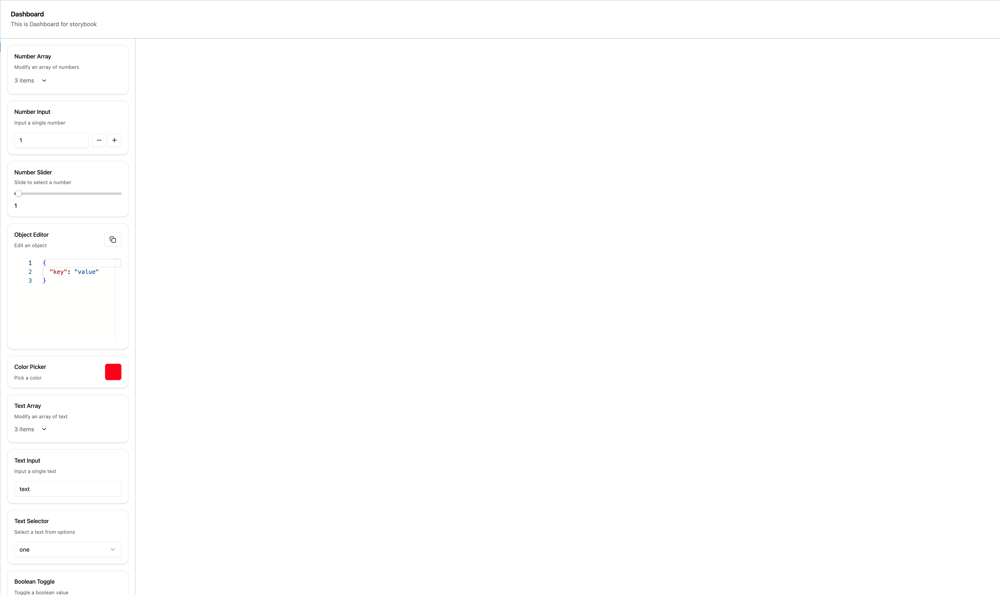
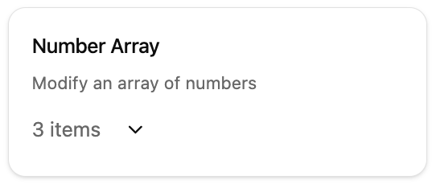
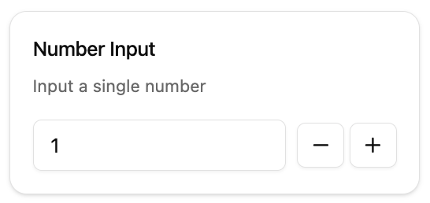
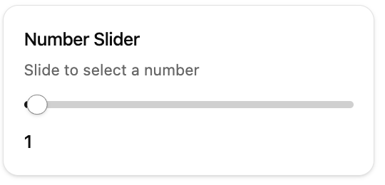
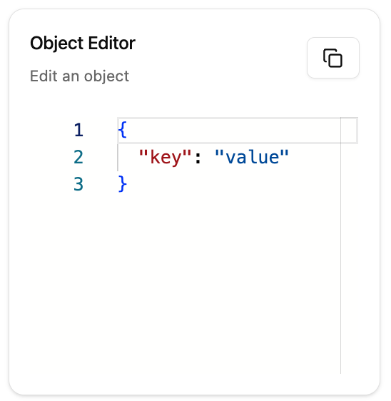
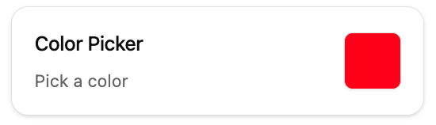
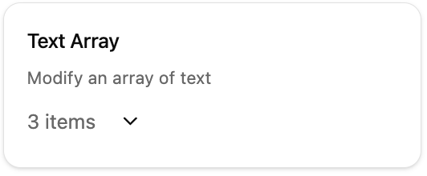
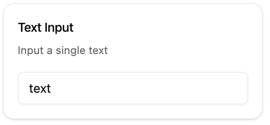
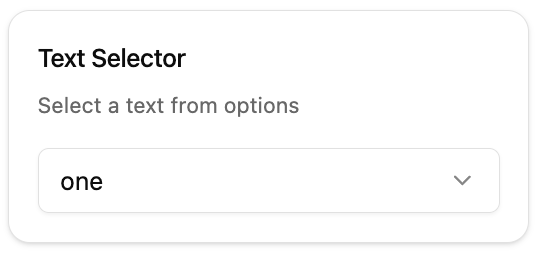
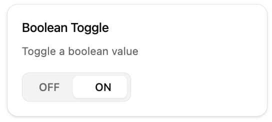

# Storybook Configurator

A powerful tool to set up your stories interactively and easily.

## Table of Contents

-   [Dashboard Component](#dashboard-component)
-   [State Management](#state-management)
-   [Control Components](#control-components)

## Common Props

All components share these base props:

| Prop          | Type   | Description                  |
| ------------- | ------ | ---------------------------- |
| `title`       | string | Title of the component       |
| `description` | string | Description of the component |

## Dashboard Component



The Dashboard component serves as the main container for your interactive stories.

### Props

| Prop       | Type                 | Description                                          |
| ---------- | -------------------- | ---------------------------------------------------- |
| `controls` | Control[]            | Array of control components to be placed on the left |
| `options`  | { minWidth: number } | Configuration options for the dashboard              |
| `children` | ReactNode            | Components to display in the main area               |

### Example Usage

```tsx
<Dashboard
    controls={controls}
    title="Dashboard"
    description="This is Dashboard for storybook"
>
    <YourComponent />
</Dashboard>
```

## State Management

### useControlState Hook

The `useControlState` hook provides an easy way to manage multiple states for your controls.

```tsx
const [state, setState] = useControlState({
    numberarray: [1, 2, 3],
    numberinput: 1,
    numberslider: 1,
    objecteditor: { key: 'value' },
    colorpicker: '#ff0000',
    textarray: ['one', 'two', 'three'],
    textinput: 'text',
    textselect: 'one',
    booltoggle: true,
});

// Usage
state.numberarray; // Get state value
setState('numberarray', newValue); // Set state value
```

## Control Components

### 1. NumberArray



A component to modify an array of numbers.

```tsx
<NumberArray
    title="Number Array"
    description="Modify an array of numbers"
    value={state.numberarray}
    setValue={(value: number[]) => setState('numberarray', value)}
/>
```

### 2. NumberInput



Input component for single number values.

#### Options

```tsx
type NumberInputOptions = {
    min?: number; // Minimum possible value
    max?: number; // Maximum possible value
    step?: number; // Step for click event
};
```

```tsx
<NumberInput
    title="Number Input"
    description="Input a single number"
    value={state.numberinput}
    setValue={(value: number) => setState('numberinput', value)}
    options={{ min: 0, max: 100, step: 1 }}
/>
```

### 3. NumberSlider



A slider component for number values.

#### Options

```tsx
type NumberSliderOptions = {
    min?: number; // Minimum possible value
    max?: number; // Maximum possible value
    step?: number; // Step for slider
    showInput?: boolean; // Show explicit input
};
```

```tsx
<NumberSlider
    title="Number Slider"
    description="Slide to select a number"
    value={state.numberslider}
    setValue={(value: number) => setState('numberslider', value)}
    options={{ min: 0, max: 100, step: 1, showInput: true }}
/>
```

### 4. ObjectEditor



An editor for objects and arrays.

#### Options

```tsx
type ObjectEditorOptions = {
    height?: string; // Height for editor
    readOnly?: boolean; // Read only flag
};
```

```tsx
<ObjectEditor
    title="Object Editor"
    description="Edit an object"
    value={state.objecteditor}
    setValue={(value: unknown) => setState('objecteditor', value)}
    options={{ height: '300px' }}
/>
```

### 5. ColorPicker



A component for selecting colors.

```tsx
<ColorPicker
    title="Color Picker"
    description="Pick a color"
    value={state.colorpicker}
    setValue={(value: string) => setState('colorpicker', value)}
/>
```

### 6. TextArray



Modify an array of text values.

```tsx
<TextArray
    title="Text Array"
    description="Modify an array of text"
    value={state.textarray}
    setValue={(value: string[]) => setState('textarray', value)}
/>
```

### 7. TextInput



Input component for text values.

#### Options

```tsx
type TextInputOptions = {
    placeholder?: string; // Placeholder for input
    maxLength?: number; // Maximum length of text
};
```

```tsx
<TextInput
    title="Text Input"
    description="Input a single text"
    value={state.textinput}
    setValue={(value: string) => setState('textinput', value)}
    options={{ placeholder: 'Enter text...', maxLength: 100 }}
/>
```

### 8. TextSelector



A dropdown component to select from predefined options.

```tsx
const options = ['one', 'two', 'three'];

<TextSelector
    title="Text Selector"
    description="Select a text from options"
    value={state.textselect}
    selected={state.textselect}
    setSelected={(value: string) => setState('textselect', value)}
    select={options}
/>;
```

### 9. BoolToggle



A toggle component for boolean values.

```tsx
<BoolToggle
    title="Boolean Toggle"
    description="Toggle a boolean value"
    value={state.booltoggle}
    setValue={(value: boolean) => setState('booltoggle', value)}
/>
```
